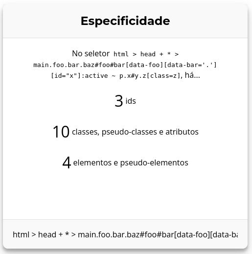

# css-specificity
[Calculadora de especificidade](https://criskell.github.io/css-specificity) simples de um seletor CSS construída para fins de estudos de seletores CSS, programação funcional e testes automatizados.

